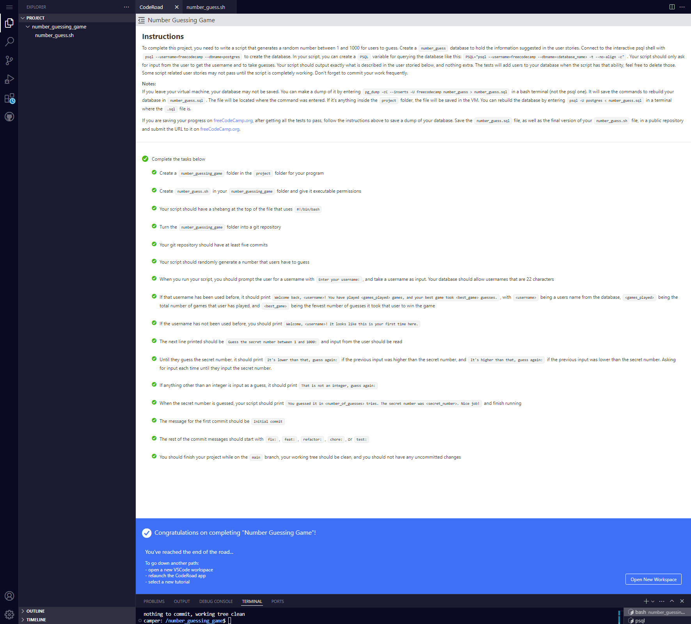

# Build a Number Guessing Game

Repositorio con el código solución al [proyecto quinto y último requisito obligatorio](https://www.freecodecamp.org/learn/relational-database/build-a-number-guessing-game-project/build-a-number-guessing-game) para obtener la [Relational Database Certification](https://www.freecodecamp.org/learn/relational-database) de freecodecamp

## Tabla de Contenidos

## Instrucciones y All Tests Passed



## Proyecto Aprobado


## Comandos SQL

```sql
CREATE DATABASE number_guess;

CREATE TABLE users(user_id SERIAL PRIMARY KEY, username VARCHAR(22) NOT NULL);

CREATE TABLE games(game_id SERIAL PRIMARY KEY, user_id INTEGER NOT NULL REFERENCES users(user_id), number_guess INTEGER NOT NULL, games_played INTEGER NOT NULL DEFAULT 0);
```

## Bash Script

```bash
#!/bin/bash

PSQL="psql --username=freecodecamp --dbname=number_guess -t --no-align -c"

GUESS_NUMBER() {
    USERNAME=$1
    echo "Guess the secret number between 1 and 1000:"
    NUMBER_OF_GUESSES=0
    read NUMBER_INPUT
    NUMBER_OF_GUESSES=$((NUMBER_OF_GUESSES + 1))
    while [[ ! $NUMBER_INPUT =~ ^[0-9]+$ ]]; do
        echo "That is not an integer, guess again:"
        read NUMBER_INPUT
        NUMBER_OF_GUESSES=$((NUMBER_OF_GUESSES + 1))
    done
    while [[ $NUMBER_INPUT -ne $SECRET_NUMBER ]]; do
        if [[ $NUMBER_INPUT -lt $SECRET_NUMBER ]]; then
            echo "It's higher than that, guess again:"
        else
            echo "It's lower than that, guess again:"
        fi
        read NUMBER_INPUT
        NUMBER_OF_GUESSES=$((NUMBER_OF_GUESSES + 1))
        while [[ ! $NUMBER_INPUT =~ ^[0-9]+$ ]]; do
            echo "That is not an integer, guess again:"
            read NUMBER_INPUT
            NUMBER_OF_GUESSES=$((NUMBER_OF_GUESSES + 1))
        done
    done
    INSERT_GAME=$($PSQL "INSERT INTO games(user_id, games_played, number_guess) VALUES((SELECT user_id FROM users WHERE username='$USERNAME'), $NUMBER_OF_GUESSES, $SECRET_NUMBER)")

    echo "You guessed it in $NUMBER_OF_GUESSES tries. The secret number was $SECRET_NUMBER. Nice job!"
}

SECRET_NUMBER=$((1 + $RANDOM % 1000))

echo "Enter your username:"

read USERNAME

if [[ -z $USERNAME ]]; then
    echo "Error: Username cannot be empty"
else
    SEARCH_USERNAME=$($PSQL "SELECT user_id FROM users WHERE username='$USERNAME'")
    if [[ -z $SEARCH_USERNAME ]]; then
        echo "Welcome, $USERNAME! It looks like this is your first time here."
        INSERT_USER=$($PSQL "INSERT INTO users(username) VALUES('$USERNAME')")
    else
        QUERY_GAMES=$($PSQL "SELECT count(*), MIN(games_played) FROM games INNER JOIN users ON games.user_id=users.user_id WHERE username='$USERNAME'")
        echo "$QUERY_GAMES" | while IFS="|" read GAMES_PLAYED BEST_SCORE; do
            echo "Welcome back, $USERNAME! You have played $GAMES_PLAYED games, and your best game took $BEST_SCORE guesses."
        done
    fi
    GUESS_NUMBER $USERNAME
fi

```
